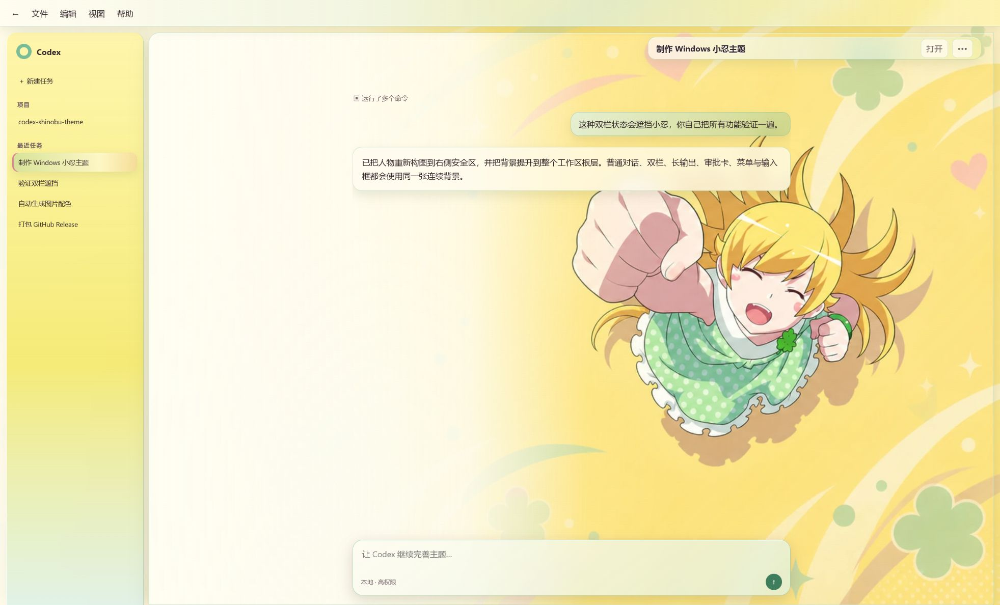
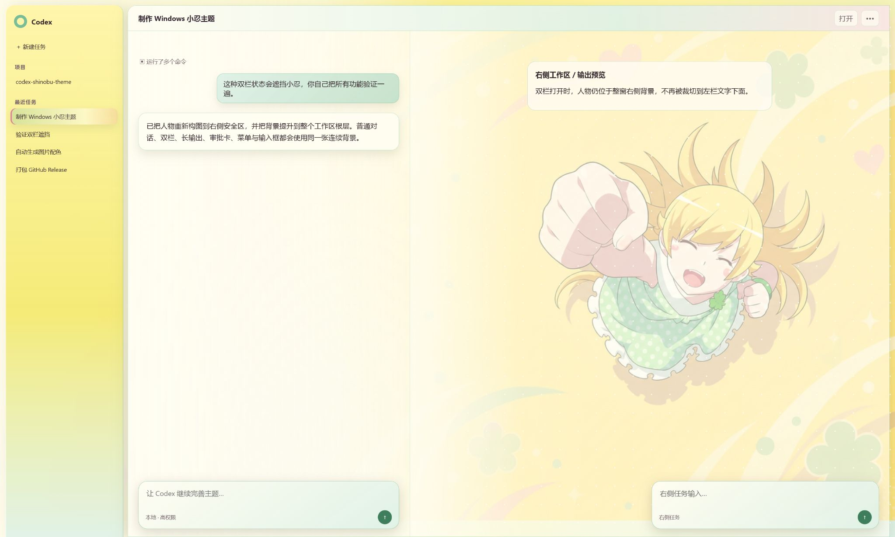
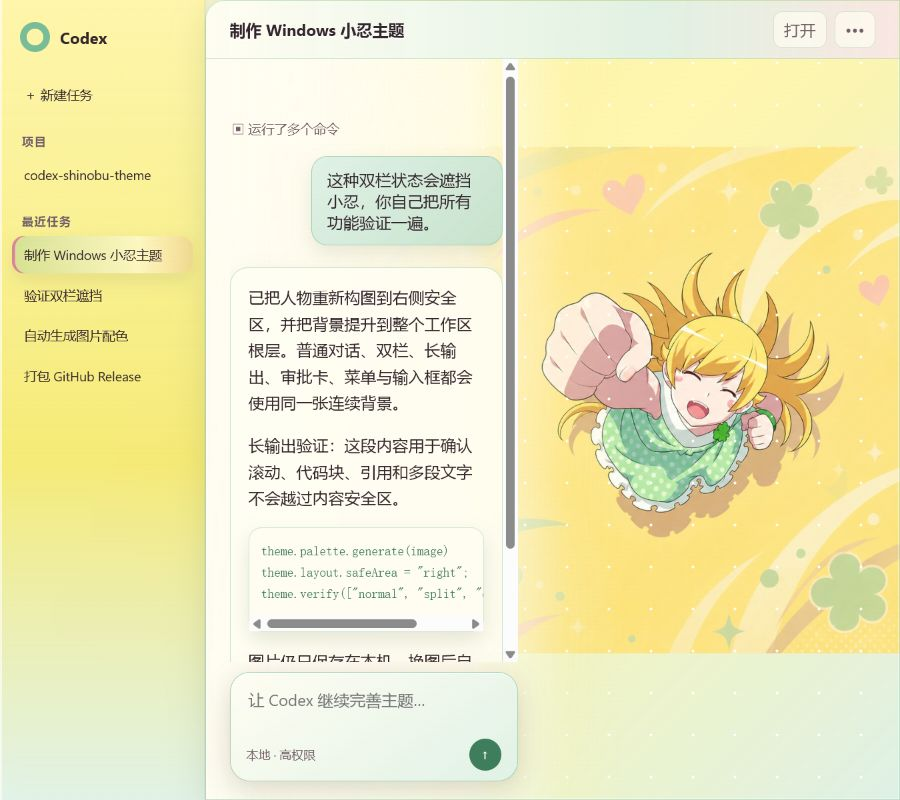
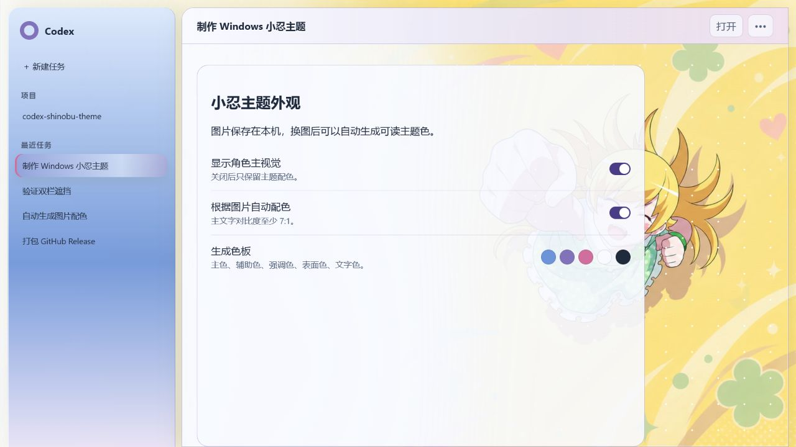
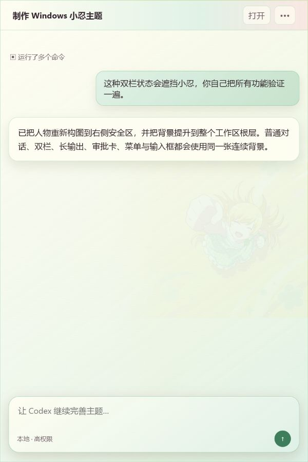

# 视觉与功能验收

本页记录 `1.2.0` 在 Windows 上的可重复验收方法与自动化布局结果。`npm test` 每次都会把发布包相同的 `src/theme.css` 和内置 WebP 重新写入 `preview/index.html`，因此数值检查针对当前代码。下方截图用于说明既有设计基线，不作为 `1.2.0` 当前代码已人工截图验收的证明。

## 结论

- 规则白点叠层已移除；默认背景使用 `cover`，在超宽和恢复窗口里不再出现图片边缘接缝。
- 应用菜单栏使用全长半透明表面；任务标题使用固定定位的 44 px 圆角玻璃条，只保留约三分之一屏宽、最大 `680px`，右侧留白 `24px`，且不重复占用正文高度。
- 内置人物安全区约为整窗横向 `60%–93%`、纵向 `20%–75%`。
- 阅读栏按可见侧栏和实际工作区实时测量，不再假定侧栏一定占据布局宽度。
- 回复、长输出和输入框在可见工作区内居中，最大宽度 `860px`；可用宽度不足 `360px` 时切换紧凑模式并加强柔化。
- 回复与输入框使用同一组测量值，缩放前后不会错位，也不会藏到展开侧栏下面；半透明玻璃允许适度覆盖人物。
- 分屏时背景只绘制一次；左、右工作区不会各自裁切一份人物。
- 长输出在自己的滚动区内滚动，底部输入框不覆盖最后一段。
- 换图、自动配色开关、关闭人物、菜单、弹窗和设置页均有独立状态验证。

## 尺寸与状态矩阵

| 场景 | 尺寸 | 验收门槛 | 结果 |
|---|---:|---|---|
| 普通对话 | 1440×900 | 应用栏 `0/1440px`；回复与输入框 `430/1290px` 居中；任务标题约 `480px` 并靠右 | 通过 |
| 恢复窗口 + 覆盖侧栏 | 1963×1188 | 侧栏右缘 `330px`；回复与输入框 `716/1576px` 居中；任务标题约 `654px` 并靠右 | 通过 |
| 分屏 + 双输入框 | 2048×1229 | 左侧回复与输入框 `317/913px`；右侧输入框 `1491/2011px`；任务标题最大 `680px` 并靠右 | 通过 |
| 长输出 | 900×800 | 回复与输入框 `230/875px` 居中对齐；内容底边 `662px`，输入框顶边 `672px` | 通过 |
| 窄窗口 | 600×900 | 侧栏隐藏；回复与输入框 `25/575px` 居中；任务标题 `320px` 靠右，无页面溢出 | 通过 |
| 审批卡 | 1440×900 | 卡片完整位于阅读栏和视口内 | 通过 |
| 菜单 | 1440×900 | 菜单完整位于视口内 | 通过 |
| 换图弹窗 | 1440×900 | 弹窗完整位于视口内，遮罩层正常 | 通过 |
| 自动配色设置 | 1440×900 | 设置面板完整可见，五个色板变量同步更新 | 通过 |
| 关闭人物 | 1440×900 | `--shinobu-art-image: none`，渐变主题仍保留 | 通过 |

## 关键截图

### 1963×1188 恢复窗口与覆盖式侧栏



### 2048×1229 分屏与双输入框



### 900×800 长输出滚动与人物安全区



### 换图后的自动配色设置



### 600×900 窄窗口



## 当前 Codex 结构基线

已在本机 Microsoft Store Codex Desktop `26.707.12708.0` 的 `app.asar` 中逐项确认以下标记存在：

- `.thread-scroll-container`
- `[data-thread-scroll-footer="true"]`
- `[data-pip-obstacle="thread-footer"]`
- `[data-mcp-app-portal-target="true"]`
- `[data-local-conversation-final-assistant]`
- `.main-surface`
- `.browser-main-surface`
- `[data-app-shell-header-edge-scroll]`

这些是主题定位对话、输入框和主工作区的实际接口。宠物/悬浮窗 renderer 会在启动时被排除，不套用主题背景。

## 自动化回归

`npm test` 当前包含 24 项测试，覆盖：

- 构建结果完全自包含，无运行时网络请求；
- renderer 启停和样式清理；
- 覆盖式侧栏的运行时测量、恢复窗口偏移、紧凑回退与停止时清理；
- 导入图片色板的生成、对比度和应用；
- 关闭自动配色后清除内联颜色；
- 旧版图片记录自动补算色板；
- 无法解码的旧图片安全回退；
- 宠物/悬浮窗 renderer 排除；
- Windows 原子安装、更新备份与卸载边界；
- 安装后 README 的本地说明书与预览链接完整；
- 非法 manifest 路径在安装和卸载前被拒绝；
- 卸载器拒绝主题或数据树中的 junction/reparse point，且在异常时不先删除另一棵目录；
- 发布 ZIP 的主题入口、图标、横版背景、说明文档、维护工具和真实 SHA-256 完整性；
- Codex 优化器的只读分析、自定义路径授权、SQLite 主库/WAL 轮换与浏览器分区缓存边界；
- 优化器在关闭 Codex 前完成唯一一次事务确认，拒绝后不会关闭进程或改动文件；
- 性能优先开关、受限过渡监听与已脱离元素的观察释放；
- 从任务页切到非任务页后，右侧任务标题标记会被移除；
- 全部视觉状态、任务标题实际工具栏偏移和响应式断点存在。

重新验收：

```powershell
npm test
npm run package
```

本页的自动化检查覆盖布局矩形、状态切换和滚动边界；仓库截图只作设计参考。每次发布仍应在 Windows Codex++ 中人工确认透明度、人物位置和实际观感，并在发布检查表中记录实测版本。
